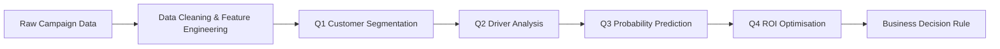

# 📊 Bank Marketing Analytics  
Customer Segmentation · Predictive Modelling · ROI Optimisation  

---

## 🔎 Project Overview  

This project analyses a bank term-deposit marketing campaign using an end-to-end data analytics workflow.  

The objectives are to:

- Understand customer structure  
- Identify key behavioural drivers  
- Predict subscription probability  
- Optimise outbound call allocation  

The project integrates unsupervised learning, supervised modelling and financial optimisation to support data-driven decision-making.

---

## 🧭 Analytical Workflow  

This structured pipeline ensures that insights flow logically from customer understanding to financial strategy.

---

# 👥 Q1 Customer Segmentation  

## 🎯 Objective  

Design interpretable customer segments that support differentiated marketing strategy.

## ⚙️ Method  

Two-tier clustering framework:

Level 1 – Background Segmentation  
- K-Means clustering  
- Demographic + financial variables  

Level 2 – Campaign Potential Segmentation  
- K-Means within each Level 1 cluster  
- Campaign behaviour variables  

Validation methods:
- Silhouette score  
- Elbow method  
- Hierarchical clustering comparison  

## 🧩 Key Segments  

C0 Young Blue-Collar Home Buyers  
C1 Affluent Educated Managers  
C2 Older Retired Savers  

Each segment was further divided into high- and low-potential subgroups.

---

# 📈 Q2 Driver Analysis  

Objective  
Identify significant demographic, financial and campaign drivers of subscription.

Approach  
- Statistical testing  
- Logistic regression  

---

# 🤖 Q3 Subscription Prediction  

Objective  
Assign each customer a subscription probability score.

Model  
Random Forest classifier  

Output  
Individual probability scores used in ROI modelling.

---

# 💰 Q4 ROI Optimisation  

## 🎯 Objective  

Determine whether it is financially worthwhile to make one additional outbound call to non-subscribers.

## 📌 Assumptions  

Outbound call cost: €5 per call  
Net profit per subscription: €50  

## 🧮 Method  

Expected Profit per Customer  

50 × Probability − 5  

Evaluate thresholds to calculate:
- Number of customers contacted  
- Expected revenue  
- Total cost  
- Net expected profit  

## 🏆 Key Findings  

Break-even threshold: 2%  
Profit-maximising threshold: 10%  

---

## 🛠 Technical Stack  

Python · Pandas · NumPy · Scikit-learn · Matplotlib  

Clustering · Machine Learning · Financial Optimisation  

---

## 🚀 What This Project Demonstrates  

- End-to-end analytical thinking  
- Structured segmentation design  
- Predictive modelling interpretation  
- Ability to translate ML outputs into financial strategy  
